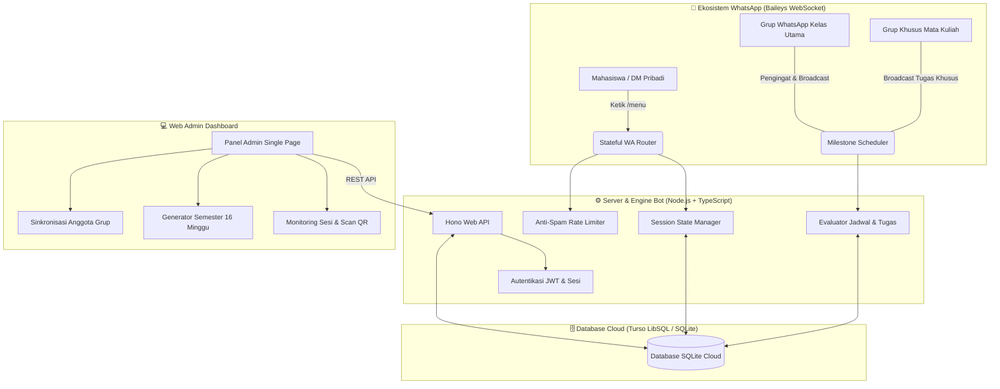

# 🎓 Bot WhatsApp & Sistem Manajemen Kelas 07TPLP025

[](https://nodejs.org/)
[](https://www.typescriptlang.org/)
[](https://github.com/WhiskeySockets/Baileys)
[](https://hono.dev/)
[](https://turso.tech/)
[](https://opensource.org/licenses/MIT)

> Solusi asisten WhatsApp bot otomatis dan Web Admin Dashboard modern yang dirancang khusus untuk koordinasi perkuliahan, pengingat jadwal otomatis, proyeksi kalender akademik 16 minggu (tatap muka & e-learning), serta broadcast pengumuman tugas multi-grup kelas.

---

## 🏛️ Arsitektur Sistem



---

## 🌟 Fitur Utama

### 1. 🤖 Bot WhatsApp Berbasis State Machine
* **Menu Angka Interaktif**: Navigasi menu terstruktur tanpa perlu mengingat perintah rumit (`/menu` ➔ `1. Jadwal Kuliah`, `2. Kontak Dosen`, `3. Tugas & Deadline`, `0. Batal`).
* **Pembeda Konteks Grup & DM**:
  * Di **Grup Kelas**: Menampilkan rekap ringkas jadwal/tugas minggu berjalan.
  * Di **DM Pribadi**: Menyediakan menu drill-down lengkap per hari (Senin - Sabtu) atau seluruh hari.
* **Keamanan Akses Whitelist**: Hanya mahasiswa yang terdaftar di grup WhatsApp kelas utama yang dapat berinteraksi via DM dengan bot.
* **Anti-Spam & Jitter Alami**: Jeda pengiriman acak (800ms - 2400ms) untuk melindungi nomor bot dari pemblokiran otomatis WhatsApp.

### 2. 📅 Generator Kalender Semester 16 Minggu
* **Proyeksi Otomatis**: Cukup tentukan 1 tanggal mulai semester, sistem langsung memproyeksikan seluruh sesi perkuliahan selama 16 minggu.
* **Dukungan Kurikulum Hybrid**:
  * **Mata Kuliah 2 SKS**: 14 Sesi Tatap Muka Offline + UTS (Minggu 8) + UAS (Minggu 16).
  * **Mata Kuliah 3 SKS**: 14 Sesi Tatap Muka Offline + 7 Sesi E-Learning (Daring) yang disebar otomatis secara merata.
* **Manajemen Perubahan Jadwal**: Fleksibel mengubah status pertemuan per tanggal (`NORMAL`, `LIBUR`, `PENGGANTI`, `ELEARNING`) lengkap dengan catatan dosen pengganti/ruangan.

### 3. ⏰ Pengingat Terjadwal Otomatis (Cron Scheduler)
* **Pukul 00:00 WIB (Setiap Hari)**: Evaluasi kalender berjalan untuk mengirimkan rekap matkul E-Learning minggu ini ke grup kelas.
* **Pukul 04:00 WIB (Setiap Hari)**: Mengirimkan jadwal kuliah hari ini, ruangan, jam mulai/selesai, dan catatan penting dosen.
* **Evaluasi Deadline Tugas Tiap 15 Menit**: Mengirimkan peringatan deadline bertahap (`H-3`, `H-2`, `H-1`, dan `H-0 jam terakhir`).
* **Anti-Duplikasi Pengingat**: Menggunakan tabel audit log `reminder_logs` sehingga bot tidak akan mengirim pesan ganda meskipun server direstart.

### 4. 🔀 Distribusi Pesan Multi-Grup Terisolasi
* **Grup Kelas Utama**: Menerima jadwal harian, rekap tugas aktif kelas, dan rekap e-learning mingguan.
* **Grup Khusus Mata Kuliah**: Bot secara otomatis meneruskan tugas dan materi khusus ke grup mata kuliah yang bersangkutan (`wa_group_jid`).

### 5. 🎛️ Web Admin Dashboard Modern & Ringan
* **Tanpa Build Bundle Berat**: Dibuat dengan Vanilla ES Modules dan CSS Dark Mode modern, responsif untuk smartphone maupun desktop.
* **Live QR Pairing**: Scan QR WhatsApp langsung dari browser dengan pembaruan status real-time.
* **Sinkronisasi Anggota 1-Klik**: Sinkronkan nomor anggota dari grup WhatsApp ke database hanya dengan menekan satu tombol.

---

## 📂 Struktur Direktori

```text
bot-wa-kelas/
├── src/
│   ├── bot/                 # Engine WhatsApp (Baileys WebSocket)
│   │   ├── handlers/        # Handler pesan (Jadwal, Dosen, Tugas)
│   │   ├── rate-limiter.ts  # Pembatas laju & jitter delay anti-spam
│   │   ├── router.ts        # Dispatcher state machine WhatsApp
│   │   ├── socket.ts        # Manajemen koneksi & QR Code Baileys
│   │   ├── state.ts         # Pengelola sesi memori percakapan
│   │   └── whitelist.ts     # Sinkronisasi anggota & pengaman akses DM
│   ├── config/              # Validasi variabel lingkungan (Zod)
│   ├── db/                  # Layer Database (LibSQL / Turso Cloud)
│   │   ├── audit.ts         # Logger aktivitas sistem
│   │   ├── generator.ts     # Mesin proyeksi 16 minggu semester
│   │   ├── index.ts         # Skema SQLite & migrasi tabel
│   │   └── seed.ts          # Inisialisasi awal database
│   ├── scheduler/           # Pekerja Otomatis Terjadwal (Cron)
│   │   ├── assignment-reminder.ts # Pengingat deadline tugas bertahap
│   │   ├── class-reminder.ts      # Pengingat jadwal pagi 04:00 WIB
│   │   ├── elearning-reminder.ts  # Pengingat e-learning 00:00 WIB
│   │   └── wib-time.ts            # Utilitas zona waktu Asia/Jakarta
│   ├── server/              # Web Server & REST API (Hono)
│   │   ├── routes/          # API endpoint (Jadwal, Tugas, Dosen, Log)
│   │   └── views/           # Tampilan Web Dashboard (HTML, CSS, JS Modules)
│   └── index.ts             # Titik masuk utama aplikasi (Bootstrap)
├── Dockerfile               # Spesifikasi kontainer Docker
├── tsconfig.json            # Konfigurasi TypeScript
└── package.json             # Dependensi & skrip aplikasi
```

---

## 🚀 Panduan Memulai Cepat

### Prasyarat
* **Node.js**: Versi `v20.0.0` atau yang lebih baru
* **Database**: SQLite lokal atau [Turso Cloud SQLite](https://turso.tech) gratis

### 1. Kloning Repository & Instalasi
```bash
# Clone repository
git clone https://github.com/Revaldi-Winata/bot-wa-kelas.git
cd bot-wa-kelas

# Install dependensi
npm install
```

### 2. Konfigurasi Lingkungan (`.env`)
Salin file template lingkungan:
```bash
cp .env.example .env
```

Sesuaikan isian di file `.env`:
```env
# Konfigurasi Server & Dashboard
PORT=3000
NODE_ENV=development
JWT_SECRET=rahasia_kunci_jwt_minimal_32_karakter_bebas

# Akun Login Admin Dashboard
ADMIN_USERNAME=admin
ADMIN_PASSWORD=adminpassword

# Database (Turso Cloud atau SQLite Lokal)
DATABASE_URL=file:./data/database.sqlite
DATABASE_AUTH_TOKEN=

# Penyimpanan Sesi WhatsApp
AUTH_FOLDER=./data/auth_info_baileys
MAIN_CLASS_GROUP_JID=
```

### 3. Menjalankan Aplikasi
```bash
# Mode pengembangan (Auto-reload)
npm run dev

# Mode produksi (Build & Jalankan)
npm run build
npm run start
```

### 4. Hubungkan WhatsApp & Atur Kelas
1. Buka browser dan masuk ke `http://localhost:3000`.
2. Login menggunakan `ADMIN_USERNAME` dan `ADMIN_PASSWORD` yang telah diatur.
3. Pada tab **Overview**, scan QR Code yang muncul menggunakan WhatsApp di HP Anda (**Perangkat Tertaut**).
4. Masuk ke tab **Anggota Kelas** ➔ **Grup Kelas**, pilih grup WhatsApp kelas utama Anda lalu klik **Sinkronkan Anggota**.
5. Masuk ke tab **Jadwal**, atur tanggal mulai semester lalu klik **Generate Proyeksi 16 Minggu**.

---

## 🧪 Pengujian Sistem (Blackbox Test)

Repository ini dilengkapi dengan rangkaian pengujian otomatis (*blackbox test*) untuk memastikan router bot, scheduler, dan deduplikasi berfungsi normal:

```bash
node --import tsx src/test-blackbox-full.ts
```

---

## 📄 Lisensi
Proyek ini bersifat sumber terbuka (*open-source*) dan dirilis di bawah lisensi [MIT License](LICENSE).

---
*Didedikasikan untuk kemudahan koordinasi akademik mahasiswa Kelas 07TPLP025 — Program Studi Teknik Informatika, Fakultas Ilmu Komputer, Universitas Pamulang.*
