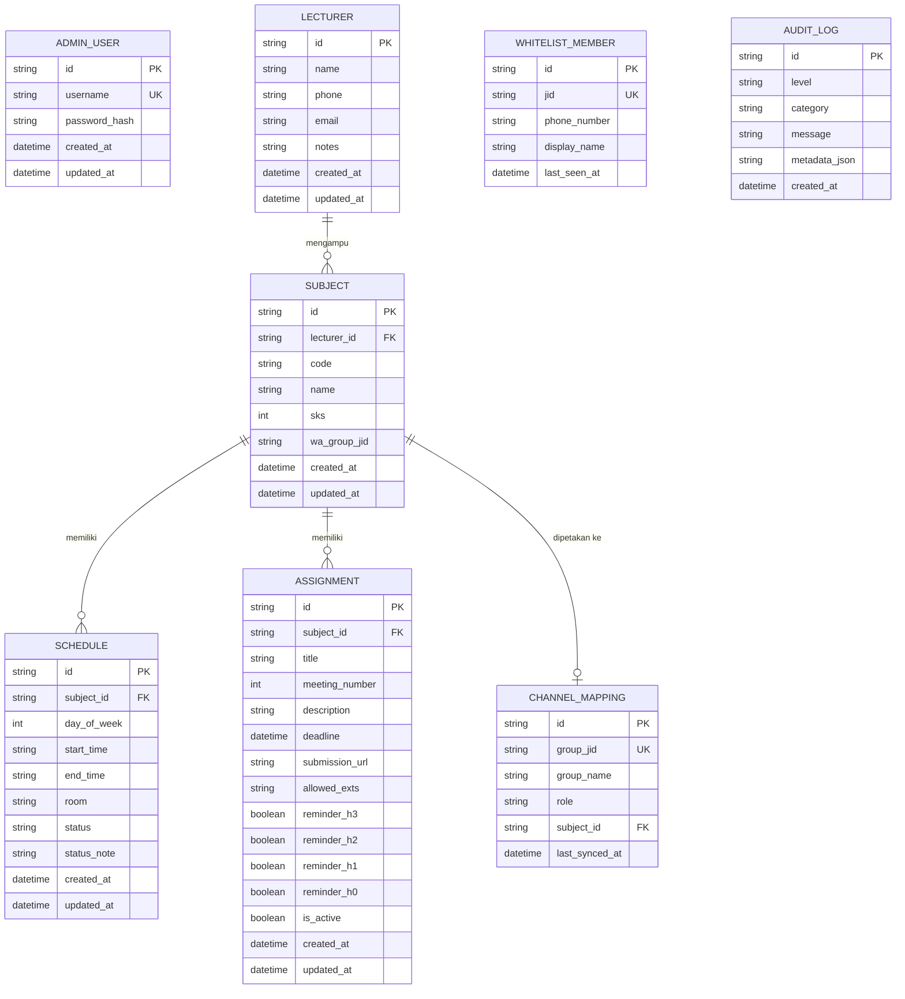

# Database Schema & Data Dictionary Specification
## Bot WhatsApp Kelas & Web Admin Dashboard

---

## 1. Database Overview & Paradigm

* **Engine**: SQLite (via Turso libSQL Cloud / Local Embedded SQLite) atau PostgreSQL (via Supabase).
* **Paradigms**: Relational, Normalized 3NF for core entities, Single Source of Truth for Bot & Dashboard.
* **Charset/Collation**: UTF-8 / NOCASE.

---

## 2. Entity-Relationship Diagram (ERD)



---

## 3. Data Dictionary & Table Definitions (DDL)

### 3.1. `admin_users`
Menyimpan kredensial otentikasi Ketua Kelas untuk mengakses Web Admin Dashboard.

| Column | Type | Constraints | Description |
| :--- | :--- | :--- | :--- |
| `id` | TEXT / VARCHAR(36) | PRIMARY KEY | UUID v4 |
| `username` | TEXT / VARCHAR(50) | UNIQUE, NOT NULL | Username login admin |
| `password_hash` | TEXT | NOT NULL | Password terenkripsi bcrypt (cost factor 12) |
| `created_at` | DATETIME | NOT NULL, DEFAULT CURRENT_TIMESTAMP | Waktu dibuat |
| `updated_at` | DATETIME | NOT NULL, DEFAULT CURRENT_TIMESTAMP | Waktu pembaruan |

---

### 3.2. `lecturers` (Data Dosen)
Menyimpan informasi kontak seluruh dosen pengampu dan asisten dosen.

| Column | Type | Constraints | Description |
| :--- | :--- | :--- | :--- |
| `id` | TEXT / VARCHAR(36) | PRIMARY KEY | UUID v4 |
| `name` | TEXT / VARCHAR(150) | NOT NULL | Nama lengkap dan gelar dosen |
| `phone` | TEXT / VARCHAR(30) | NOT NULL | Nomor WhatsApp (format internasional sanitasi, e.g. `62812...`) |
| `email` | TEXT / VARCHAR(100) | NULL | Alamat email resmi dosen |
| `notes` | TEXT | NULL | Catatan khusus (ruangan kantor, jam konsultasi) |
| `created_at` | DATETIME | NOT NULL, DEFAULT CURRENT_TIMESTAMP | Timestamp record |
| `updated_at` | DATETIME | NOT NULL, DEFAULT CURRENT_TIMESTAMP | Timestamp record |

---

### 3.3. `subjects` (Mata Kuliah)
Menyimpan entitas mata kuliah yang berjalan di semester aktif.

| Column | Type | Constraints | Description |
| :--- | :--- | :--- | :--- |
| `id` | TEXT / VARCHAR(36) | PRIMARY KEY | UUID v4 |
| `lecturer_id` | TEXT / VARCHAR(36) | NULL, FOREIGN KEY (`lecturers.id`) | Relasi ke dosen pengampu |
| `code` | TEXT / VARCHAR(20) | NULL | Kode mata kuliah (e.g. `TPL0025`) |
| `name` | TEXT / VARCHAR(100) | NOT NULL | Nama mata kuliah (e.g. `Basis Data`) |
| `sks` | INTEGER | NOT NULL, DEFAULT 2 | Bobot SKS |
| `wa_group_jid` | TEXT / VARCHAR(100) | NULL | JID WhatsApp grup khusus matkul ini (untuk scheduler) |
| `created_at` | DATETIME | NOT NULL, DEFAULT CURRENT_TIMESTAMP | Timestamp record |
| `updated_at` | DATETIME | NOT NULL, DEFAULT CURRENT_TIMESTAMP | Timestamp record |

---

### 3.4. `schedules` (Jadwal Perkuliahan)
Menyimpan sesi jadwal kuliah harian beserta status kondisionalnya.

| Column | Type | Constraints | Description |
| :--- | :--- | :--- | :--- |
| `id` | TEXT / VARCHAR(36) | PRIMARY KEY | UUID v4 |
| `subject_id` | TEXT / VARCHAR(36) | NOT NULL, FOREIGN KEY (`subjects.id`) ON DELETE CASCADE | Relasi mata kuliah |
| `day_of_week` | INTEGER | NOT NULL | `1`=Senin, `2`=Selasa, `3`=Rabu, `4`=Kamis, `5`=Jumat, `6`=Sabtu |
| `start_time` | TEXT / VARCHAR(5) | NOT NULL | Format `HH:mm` (e.g. `07:30`) |
| `end_time` | TEXT / VARCHAR(5) | NOT NULL | Format `HH:mm` (e.g. `10:00`) |
| `room` | TEXT / VARCHAR(100) | NOT NULL | Ruang fisik (e.g. `V.401`) atau tautan daring |
| `status` | TEXT / VARCHAR(20) | NOT NULL, DEFAULT 'NORMAL' | Enum: `NORMAL`, `LIBUR`, `PENGGANTI` |
| `status_note` | TEXT | NULL | Catatan jika status libur/pengganti |
| `created_at` | DATETIME | NOT NULL, DEFAULT CURRENT_TIMESTAMP | Timestamp record |
| `updated_at` | DATETIME | NOT NULL, DEFAULT CURRENT_TIMESTAMP | Timestamp record |

---

### 3.5. `assignments` (Tugas & Project Kuliah)
Menyimpan daftar tugas aktif, deadline, dan konfigurasi reminder.

| Column | Type | Constraints | Description |
| :--- | :--- | :--- | :--- |
| `id` | TEXT / VARCHAR(36) | PRIMARY KEY | UUID v4 |
| `subject_id` | TEXT / VARCHAR(36) | NOT NULL, FOREIGN KEY (`subjects.id`) ON DELETE CASCADE | Relasi mata kuliah |
| `title` | TEXT / VARCHAR(200) | NOT NULL | Judul tugas (e.g. `Tugas ERD Database Toko`) |
| `meeting_number` | INTEGER | NOT NULL, DEFAULT 1 | Pertemuan ke- (1 - 16) untuk folder traversal GDrive |
| `description` | TEXT | NOT NULL | Deskripsi instruksi pengerjaan |
| `deadline` | DATETIME | NOT NULL | Batas waktu akhir pengumpulan |
| `submission_url` | TEXT | NULL | Tautan langsung folder pengumpulan GDrive |
| `allowed_exts` | TEXT | NOT NULL, DEFAULT 'pdf,zip' | Format file diizinkan (comma-separated) |
| `reminder_h3` | BOOLEAN | NOT NULL, DEFAULT 1 | Toggle broadcast pengingat H-3 |
| `reminder_h2` | BOOLEAN | NOT NULL, DEFAULT 1 | Toggle broadcast pengingat H-2 |
| `reminder_h1` | BOOLEAN | NOT NULL, DEFAULT 1 | Toggle broadcast pengingat H-1 |
| `reminder_h0` | BOOLEAN | NOT NULL, DEFAULT 1 | Toggle broadcast pengingat Hari-H |
| `is_active` | BOOLEAN | NOT NULL, DEFAULT 1 | Status aktif tugas |
| `created_at` | DATETIME | NOT NULL, DEFAULT CURRENT_TIMESTAMP | Timestamp record |
| `updated_at` | DATETIME | NOT NULL, DEFAULT CURRENT_TIMESTAMP | Timestamp record |

---

### 3.6. `channel_mappings` (Pemetaan Channel WhatsApp)
Menyimpan konfigurasi peran grup-grup WhatsApp yang dimasuki bot.

| Column | Type | Constraints | Description |
| :--- | :--- | :--- | :--- |
| `id` | TEXT / VARCHAR(36) | PRIMARY KEY | UUID v4 |
| `group_jid` | TEXT / VARCHAR(100) | UNIQUE, NOT NULL | WhatsApp JID (e.g. `12036302...@g.us`) |
| `group_name` | TEXT / VARCHAR(150) | NOT NULL | Nama grup WhatsApp |
| `role` | TEXT / VARCHAR(30) | NOT NULL | Enum: `MAIN_CLASS_GROUP`, `SUBJECT_GROUP`, `IGNORED` |
| `subject_id` | TEXT / VARCHAR(36) | NULL, FOREIGN KEY (`subjects.id`) | Relasi jika role `SUBJECT_GROUP` |
| `last_synced_at`| DATETIME | NOT NULL, DEFAULT CURRENT_TIMESTAMP | Timestamp sinkronisasi |

---

### 3.7. `whitelist_members` (Dynamic Whitelist Mahasiswa)
Menyimpan cache peserta Grup Utama Kelas untuk otorisasi akses WhatsApp DM.

| Column | Type | Constraints | Description |
| :--- | :--- | :--- | :--- |
| `id` | TEXT / VARCHAR(36) | PRIMARY KEY | UUID v4 |
| `jid` | TEXT / VARCHAR(100) | UNIQUE, NOT NULL | User JID (e.g. `628123456789@s.whatsapp.net`) |
| `phone_number` | TEXT / VARCHAR(30) | NOT NULL | Nomor telepon bersih |
| `display_name` | TEXT / VARCHAR(150) | NULL | Nama tampilan WhatsApp |
| `last_seen_at` | DATETIME | NOT NULL, DEFAULT CURRENT_TIMESTAMP | Waktu interaksi terakhir |

---

### 3.8. `audit_logs` (System Logs & Audit Trail)
Menyimpan riwayat eksekusi sistem, broadcast, dan error.

| Column | Type | Constraints | Description |
| :--- | :--- | :--- | :--- |
| `id` | TEXT / VARCHAR(36) | PRIMARY KEY | UUID v4 |
| `level` | TEXT / VARCHAR(10) | NOT NULL | `INFO`, `WARN`, `ERROR` |
| `category` | TEXT / VARCHAR(50) | NOT NULL | `AUTH`, `WHATSAPP`, `SCHEDULER`, `GDRIVE` |
| `message` | TEXT | NOT NULL | Ringkasan pesan aktivitas |
| `metadata_json` | TEXT | NULL | Payload detail / Error stack trace dalam JSON |
| `created_at` | DATETIME | NOT NULL, DEFAULT CURRENT_TIMESTAMP | Timestamp log |

---

## 4. Query Access Patterns & Indexes

Untuk menjamin performa query < 5ms:

```sql
-- Indeks query jadwal per hari
CREATE INDEX idx_schedules_day ON schedules(day_of_week);

-- Indeks query tugas aktif terurut deadline
CREATE INDEX idx_assignments_active_deadline ON assignments(is_active, deadline ASC);

-- Indeks pengecekan whitelist JID
CREATE INDEX idx_whitelist_jid ON whitelist_members(jid);

-- Indeks pencarian subject berdasarkan nama
CREATE INDEX idx_subjects_name ON subjects(name COLLATE NOCASE);

-- Indeks pencarian dosen berdasarkan nama
CREATE INDEX idx_lecturers_name ON lecturers(name COLLATE NOCASE);
```
